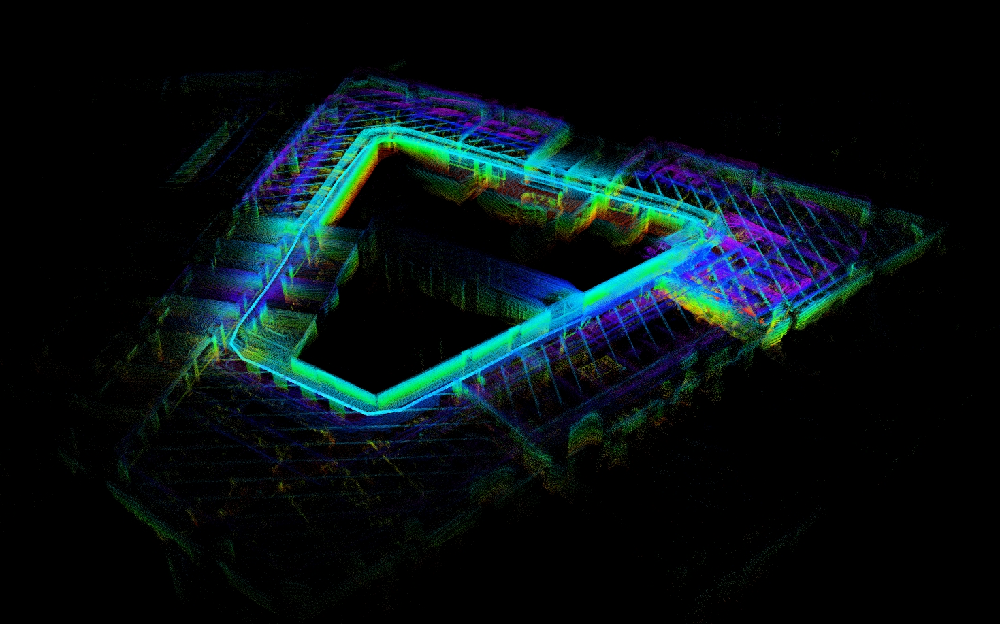

# FAST_LIO_Hesai

FAST_LIO_Hesai provides Hesai-adapted FAST-LIO2 support for JT16 and JT128 LiDARs.

This repository supports:

* ROS 1: `main` branch, Ubuntu 18.04 / 20.04, ROS Melodic / Noetic
* ROS 2: `ROS2` branch, Ubuntu 22.04, ROS 2 Humble
* Input: standard `sensor_msgs/PointCloud2` + `sensor_msgs/Imu`
* LiDAR models: JT16, JT128

## Overview

FAST-LIO2 is a tightly-coupled LiDAR-inertial odometry algorithm. This repository adapts FAST-LIO2 for Hesai JT16 and JT128 LiDARs through standard point cloud and IMU topics.

Example mapping result:



> The image above is for demonstration only. Actual mapping performance may vary depending on the LiDAR model, IMU data quality, timestamp accuracy, scene structure, motion pattern, and computing platform.

## Documentation

For complete installation, configuration, rosbag replay, real-time LiDAR connection, RViz visualization, PCD saving, parameter explanation, and troubleshooting, please refer to the official developer documentation:

* 中文：[使用 FAST-LIO2 算法](开发者中心链接)
* English: [FAST-LIO2 Guide](英文文档链接，如果有)

## Branches

| ROS Version | Branch | Build Tool     | Launch        |
| ----------- | ------ | -------------- | ------------- |
| ROS 1       | `main` | `catkin_make`  | `roslaunch`   |
| ROS 2       | `ROS2` | `colcon build` | `ros2 launch` |

## Required Input

Default topics:

| Data        | Topic           |
| ----------- | --------------- |
| PointCloud2 | `/lidar_points` |
| IMU         | `/lidar_imu`    |

Required point fields:

```text
x, y, z, intensity, ring, timestamp
```

The point cloud must contain per-point `ring` and `timestamp` fields. The `timestamp` field is used for motion compensation.

## Quick Command

ROS 1:

```bash
roslaunch fast_lio mapping_jt16.launch
roslaunch fast_lio mapping_jt128.launch
```

ROS 2:

```bash
ros2 launch fast_lio mapping_jt16.launch.py
ros2 launch fast_lio mapping_jt128.launch.py
```

## Supported Models

| Model | ROS 1     | ROS 2     |
| ----- | --------- | --------- |
| JT16  | Supported | Supported |
| JT128 | Supported | Supported |

## Known Notes

* Windows native environment is not supported.
* Ubuntu + ROS is the recommended runtime environment.
* The Hesai ROS Driver must publish `/lidar_points` and `/lidar_imu` before starting FAST-LIO2.
* `PointCloud2` must contain `ring` and `timestamp` fields.
* For detailed parameter settings, PCD saving, rosbag replay, and troubleshooting, use the official developer documentation as the primary reference.

## Issue Reporting

When reporting an issue, please include:

* LiDAR model: JT16 / JT128
* ROS version: ROS 1 Melodic / Noetic or ROS 2 Humble
* Ubuntu version
* FAST_LIO_Hesai branch / commit
* Hesai ROS Driver version / commit
* Running mode: real-time LiDAR / rosbag replay
* Output of `rostopic list` or `ros2 topic list`
* Output of `rostopic hz /lidar_points` and `rostopic hz /lidar_imu`
* Related logs, screenshots, or rosbag if available

## Acknowledgements

This project is a fork of [FAST_LIO](https://github.com/hku-mars/FAST_LIO) by the MARS Lab, HKU, adapted for Hesai JT16 / JT128 LiDARs. It also builds on [LOAM](https://www.ri.cmu.edu/publications/loam-lidar-odometry-and-mapping-in-real-time/) (J. Zhang and S. Singh) and contributions from Livox.

FAST-LIO2 is described in:

> W. Xu, Y. Cai, D. He, J. Lin, and F. Zhang, "FAST-LIO2: Fast Direct LiDAR-Inertial Odometry," IEEE Transactions on Robotics, 2022.

## License

This software is released under the GNU General Public License v2 (GPL-2.0), consistent with the upstream FAST_LIO project. See [LICENSE](./LICENSE). Original copyright notices in the source files are retained. Modifications by Hesai adapt the upstream code for JT16 / JT128 LiDARs.
